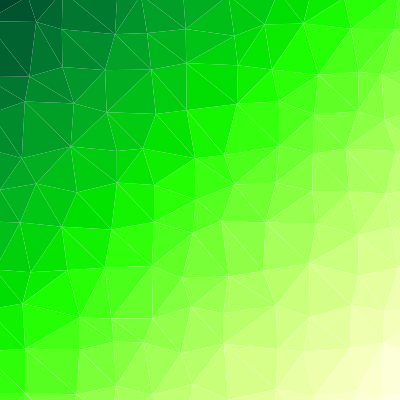
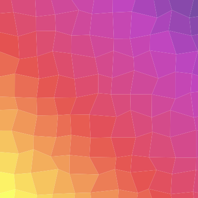

# PolygonBG

PolygonBG参考[trianglify](https://github.com/qrohlf/trianglify)制作。

本项目用于生成由多边形组成的svg背景图片。




# Usage
html
```html
<script src="polypg.min.js"></script>
```
js
```javascript
var option = {
    width: 600,
    height: 600,
    layout: {
        type: 'triangle',
        size: 60,
        jitter: 0.5
    },
    color: {
        type: 'liner',
        directionX: -1,
        directionY: 1,
        scale: ['#ffffe5', '#004529'],
        mode: 'hsl'
    },
    hover: {
        color: 'trans'
    }
}
let svg = polybg(option).generateSVG()
```

# Option

|选项|说明|备注|
|--|--|--|
|width|svg的宽度|默认值400|
|height|svg的高度|默认值400|
|layout|svg的布局选项|详见 [layout](##layout)|
|color|svg的颜色选项|详见 [color](##color)|
|hover|多边形hover时的样式|详见 [hover](##hover)|

## layout

### `type`

设置svg的总体样式。默认值为 `triangle`

|值|说明|
|--|--|
|"triangle"|用紧密排列的三角形平铺svg|
|"square"|用紧密排列的正方形平铺svg|

### `size`

指定多边形的基础大小。默认值 `60` 。*当svg长宽与size比例过大时，生成过程会很慢！（需要优化）*

### `jitter`

指定多边形的形状的波动，jitter值越大，图形变化越明显。默认值 `0` 。*设定范围为0-1之间（包括 0 和 1）。*


## color

### `type`

设置填充svg颜色的方式。
|值|说明|
|--|--|
|"liner"|用渐变的方式填充颜色，渐变方向为x轴和y轴|
|"circle"|用渐变的方式填充颜色，渐变方向为图形中心向四周渐变|

### `scale`

设置颜色渐变的色阶。默认值为 `["#ffffff","#000000"]` 。

### `mode`

设置过渡色阶的模式。默认值为 `"hsl"` 。详见[chroma.mix](https://gka.github.io/chroma.js/#chroma-mix)

### `directionX`

*仅当 [`type`](###type) 设置为 `"liner"` 时生效。*

设置渐变在x轴上的方向，小于 `0` 时在x轴负方向上渐变，大于 `0` 时在x轴正方向上渐变，等于 `0` 时不在x轴上渐变。默认值为 `1` 。


### `directionY`

*仅当 [`type`](###type) 设置为 `"liner"` 时生效。*

设置渐变在y轴上的方向，小于 `0` 时在y轴负方向上渐变，大于 `0` 时在y轴正方向上渐变，等于 `0` 时不在y轴上渐变。默认值为 `0` 。

*当 `directionX` 和 `directionY` 同时被设置为0时，渐变方向为左上至右下。*

## hover

### `color`

设置鼠标放置于多边形上时，多边形的颜色。

|值|说明|
|--|--|
|"trans"|计算当前颜色的反色（目前好像不是反色，需验证）|
|其它|设置为指定颜色|

## Test

在 [index.html](./dist/index.html) 测试option